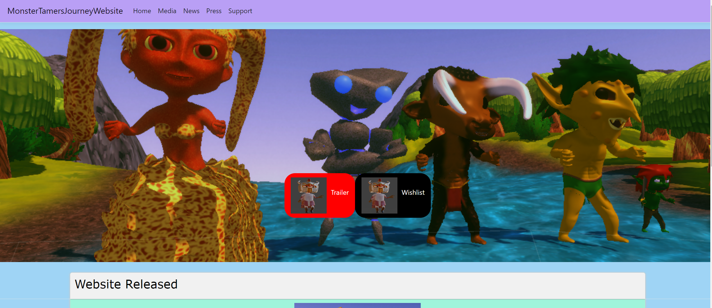
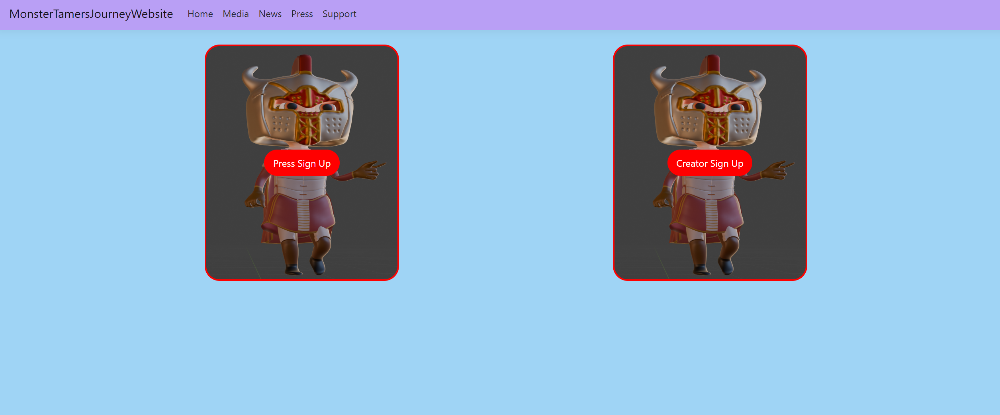
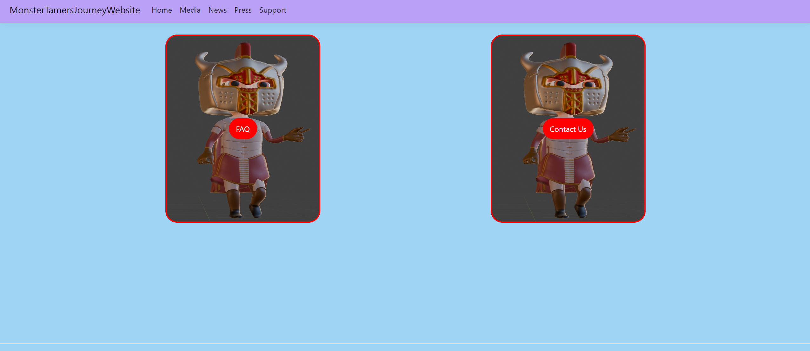
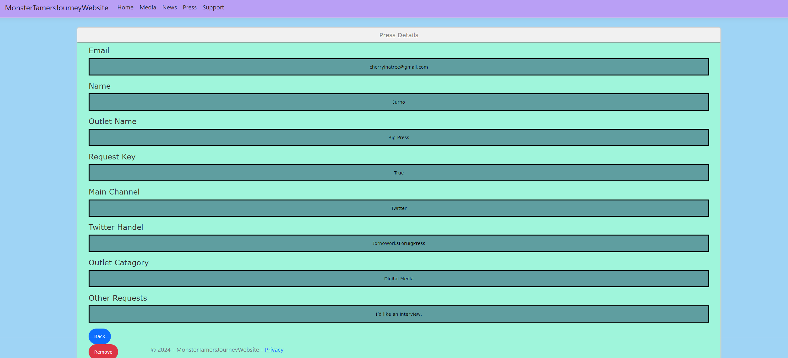

# MonsterTamerWebsite
 Website for the video game Monster Tamer's Journey
 
## Overview

At the moment the basics of the website are functional. The server has been set up, that admin side is able to recive information
from users such as sign up and support requests, and the admin is able to post/change content. The next step is to change the nave
bar on the admin side, bug test, add needed things such as a confirm popup, then polish the site to make it look pretty. 

## ImagesOfPrototypeInCurrentState

Website Home: 
Website Media: 
website News: 
Website Press: 
Website Contact: 
Website Press List: 
Website Creator List: 
Website FAQ: 
Website Popup Confirm: 
Website Support: 
Admin Creator List: 
Website Admin FAQ add: 
Website Admin FAQ Remove: 
Website Admin Hub: 

