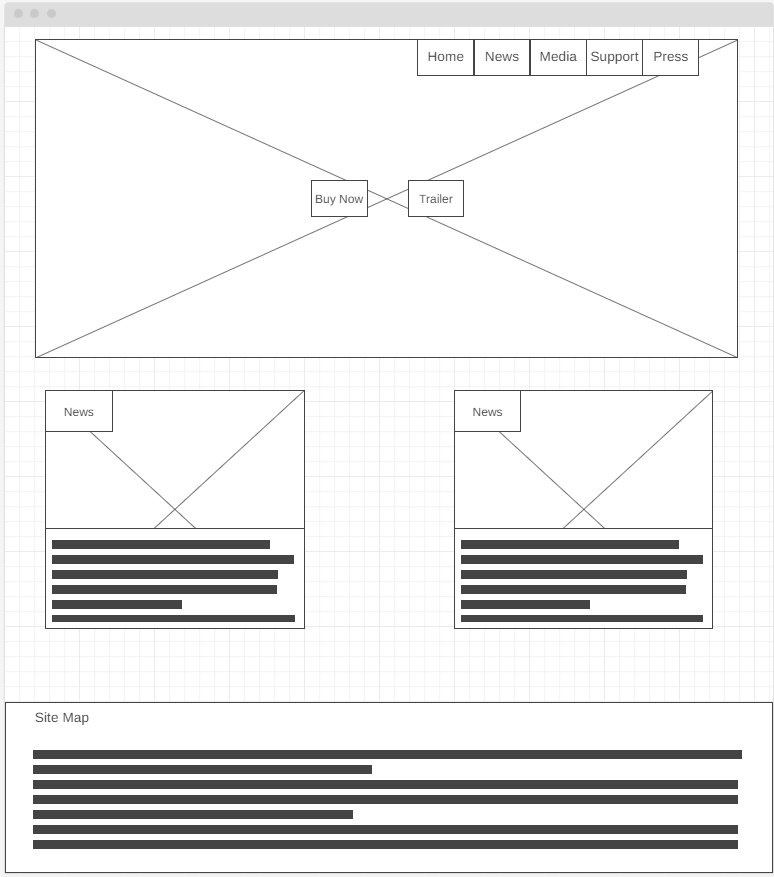
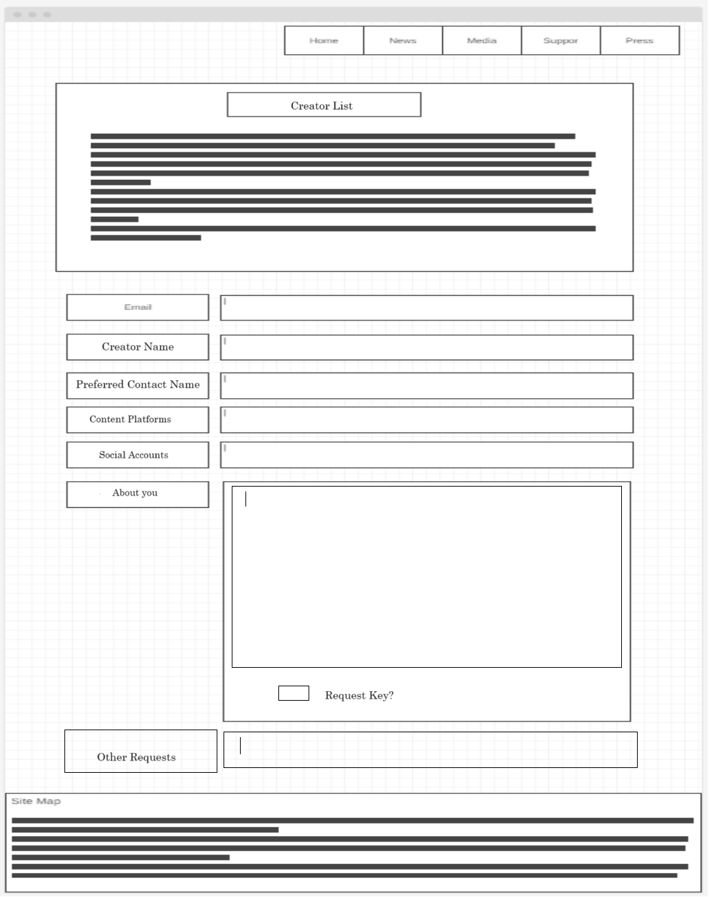

# MonsterTamerWebsite
 Website for the video game Monster Tamer's Journey
## Overview

This website is meant to serve as the central advertising point of the video game “The Monster Tamer’s Journey”. It will provide images and trailers of the game, answer frequently asked questions, and have a registration for media personnel such as journalists, streamers, and influencers to contact and receive free copies of the game. The website will also provide news and updates about the video game. 

#### Design: 
The website is taking inspiration from the Slime Rancher video game website. The website is going to have 12 pages.
Pages:
1.	Home
2.	News
3.	Media
4.	Press
5.	Support
6.	FAQ
7.	Contact Us
8.	Third Party Licenses
9.	Privacy Policy
10.	Credits
11.	Log In
12.	Media information
13.	Media interact

The website log in page won’t have a link to reach it from any other page. The only purpose of the log in page is for the site master to easily edit the pages without having to hard code things on the website. There will need to be a second version of the website for the logged-in site master that allows each area to be edited. The site master will also have access to a page that gives information about media personnel that have signed up for a free copy. The site master will be able to click on one of the media personnel to enter information about verification and interactions with the media personnel. 
	
#### Database:  
The database will have 3 main sections, admins, media, and content. The admins will be the only accounts on the website, and they will have permission to edit the website. The media will be people who have submitted to receive a free copy of the game. The content is what is displayed on the webpages, primarily text. 

The admin tables will include a main table with ID, email, and password. For security purposes, I think the admin should have another table that logs when they logged on. There should be another table that says what the admin changed and when they changed it. If there are several admins, then if there is a compromised account, this will make it easier to know which account it is and take action to prevent any more malicious interactions.  

The media tables will include a main table with name, email, password, organization. There will need to be another table to determine if the media personnel have been verified. This will consist of Boolean values. The values include contacted, verified, sent a copy. There will need to be a table of notes about the media personnel so the site master can document their interactions with them.
	
The final section of the database is the content. This section will have a main table that has the ID, a title field, a text field, and a Boolean for if the text is news. There may be another table for images, but at the moment, hard coding the images and videos appears fine since this is a single player game and not a constantly evolving online game. Just having text editable will reduce scope, making the website a little more manageable since website will mainly just have text edited.

#### Conclusion:  
The video game websites I looked have most of the relevant information to the user above the fold on the home page. The information includes an appealing image of the game, the title of the game, a trailer of the game, where to buy the game, and a nav bar for more information. The website will have a site map at the footer of every page and a nav bar at the top. Below the fold will be news about the game. The news will be the last 10 pieces of news appearing in the order it was created from newest to oldest. The new page will have the rest of the news. This should be everything the user needs to know and be SEO ready so Google should have everything it needs to answer peoples questions. 


## User Stories
1:
``` 
* As a potential customer
* I need to see content
* So that I can decide if I want this game
```
2:
``` 
* As a potential Journalist writing about the game
* I need a way to recieve a demo
* So that I can review the game
```
3:
``` 
* As a potential streamer
* I need a way to recieve a demo
* So that I can review the game
```
4:
``` 
* As a potential customer
* I need to contact the support team
* So that I can fix an issue I'm having with the game
```
5:
``` 
* As a potential customer
* I need to see news about the game
* So that I understand what changed in the latest update
```


## Initial Use Cases
1:
``` 
Deciding whether to buy
The Media System
Customer

The customer will head to the home page of the website. 
Deciding if they want to buy the game, 
they will want to see content. 
The customer will look at the nav bar and see media. 
When they click on media, the request for the media page will be sent.
The browser will recieve the media page with embeded YouTube videos of trailers.
There will also be images of in game content. 
The customer will click on a trailer and it will start playing on the media page.
The user will have the option to click on a button on the video that will take
them to YouTube if they prefer to watch the video there. 
This option is provided by the YouTube embeded video system. 

```
2:
``` 
Journalist Needing a Demo
The Press System
Journalist 

The journalist will head to the home page of the website. 
The journalist will navigate to the nav bar and click the press button.
The request for the page will be sent to the server and the server will
send back the press page. 
On the press page they will click the sign up button under the journalist image.
The requst for the journalist sign up page will be sent to the server and the
journalist sign up page will be returned to the browser. 
The Journalist will fill out the sign up form and check that they want a demo.
They will submit the page and be contacted shortly after they've been evaluated. 
```
3:
``` 
Streamer Needing a Demo
The Press System
Streamer

The streamer will head to the home page of the website. 
The streamer will navigate to the nav bar and click the press button.
The request for the page will be sent to the server and the server will
send back the press page. 
On the press page they will click the sign up button under the streamer image.
The requst for the streamer sign up page will be sent to the server and the
streamer sign up page will be returned to the browser. 
The streamer will fill out the sign up form and check that they want a demo.
They will submit the page and be contacted shortly after they've been evaluated. 
```
4:
``` 
Solving a Technical Issue
The Support System
Customer

The customer is having a problem with the game.
The customer will arive on the home page.
The customer will head over the the Support button on the nav bar.
The support button will send a request for the support page.
The server will send the support page to the browser.
The customer will click on the FAQ button and the requst for the FAQ page will be sent. 
The browser will be sent the FAQ page.
The customer will find a drop down bar that has their question on it.
When the customer clicks on it, the answer will appear in the drop down.
```
5:
``` 
Finding News about and Update
The News System
Customer

The customer wants to know what changed in the latest update. 
The customer will find themselves on the home page. 
The customer will click on the News button on the nav bar.
The request will be sent to the server for the News page.
The server will send the browser the News page.
On the news page, the user will find a Image with a text title on top of the update. 
The image will also be overlaid with text explaining the update. 

```


## Solution Architecture Diagram

Soultion Arch Diagram: 

## Use Case Diagram

Use Case Diagram: 


## Requirements


| ID | Requirement |
|:---:| ----------:|
| 1 |  The software shall allow users to video in game content so they may decide if they want to buy the game. The software shall have a page dedicated to trailers, screenshots, and videos of things happening in game. |
| 2 | The software shall allow journalists to be able to sign up for a demo. The page with the sign up shall gather information from the journalist so they can be authenticated, and a correspondence can be established. |
| 3 | The software shall allow Streamers to be able to sign up for a demo. The page with the sign up shall gather information from the Streamers so they can be authenticated, and a correspondence can be established. |
| 4 | The software shall have a way for users to find solutions to their technical issues. This shall include a Frequently Asked Questions page and a Support page for users to contact the site admin. |
| 5 | The software shall include a page where users can find information about updates to the game. This page shall also include any information surrounding the game such as upcoming merchandise and DLC. | 
|||


## Wireframe diagrams

Website Home: 
Website Media: 
website News: 
Website Press: 
Website Contact: 
Website Press List: 
Website Creator List: 
Website FAQ: 
Website Popup Confirm: 
Website Support: 
Admin Creator List: 
Website Admin FAQ add: 
Website Admin FAQ Remove: 
Website Admin Hub: 
Website Admin Log In: 
Website Admin Media Add: 
Website Admin Media Remove: 
Website Admin News Add: 
Website Admin News Remove: 
Website Admin Press List: 
Website Admin Support View: 


## ERD

Website Home: 


## UML

Website Home: 

